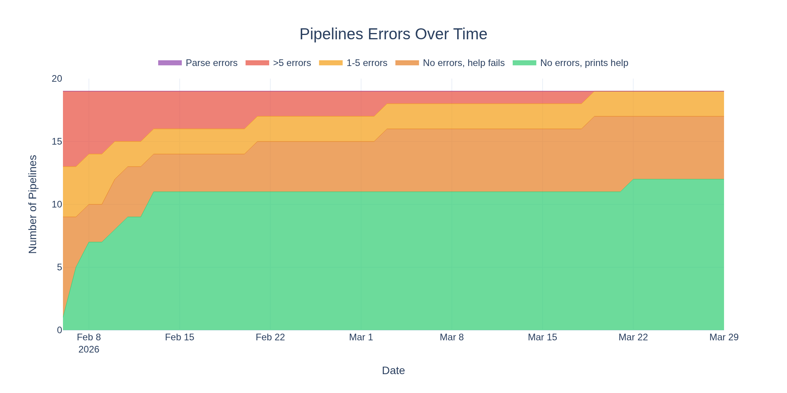
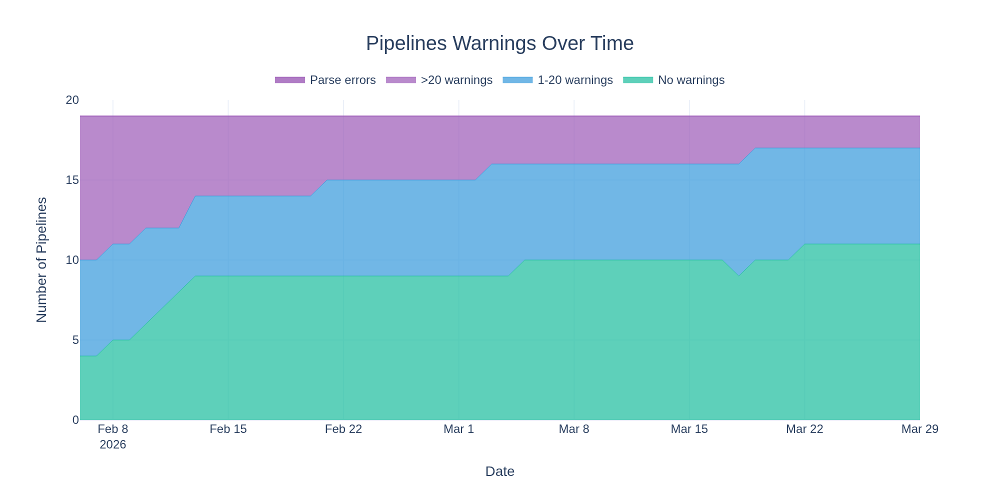
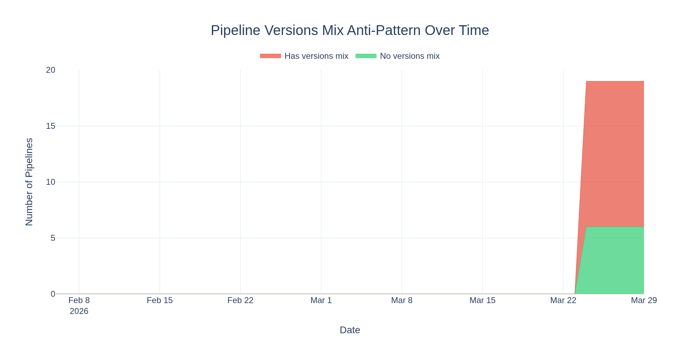
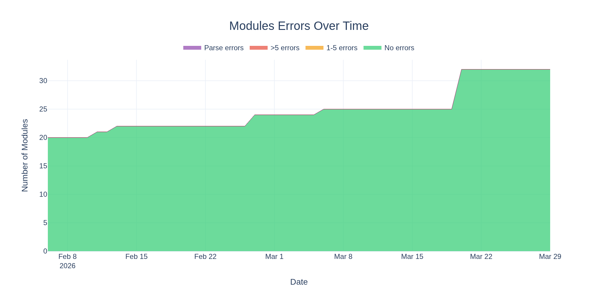
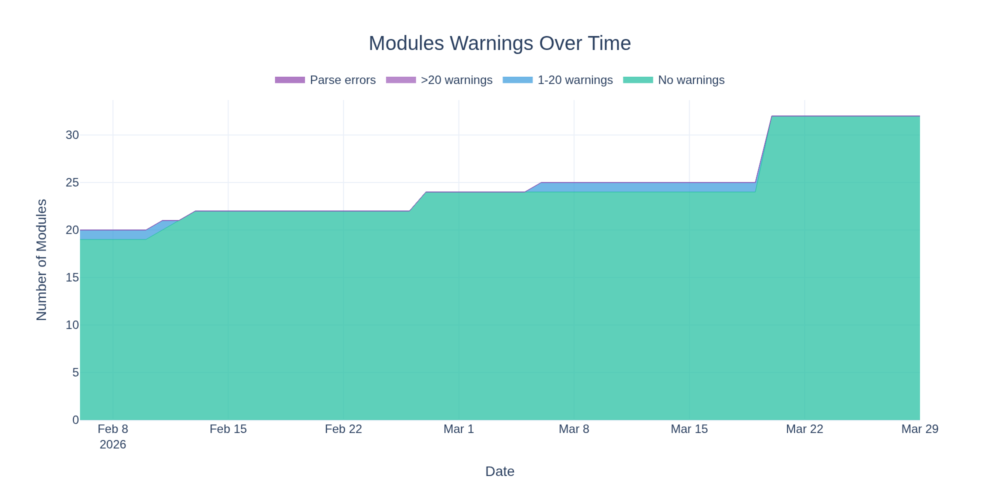
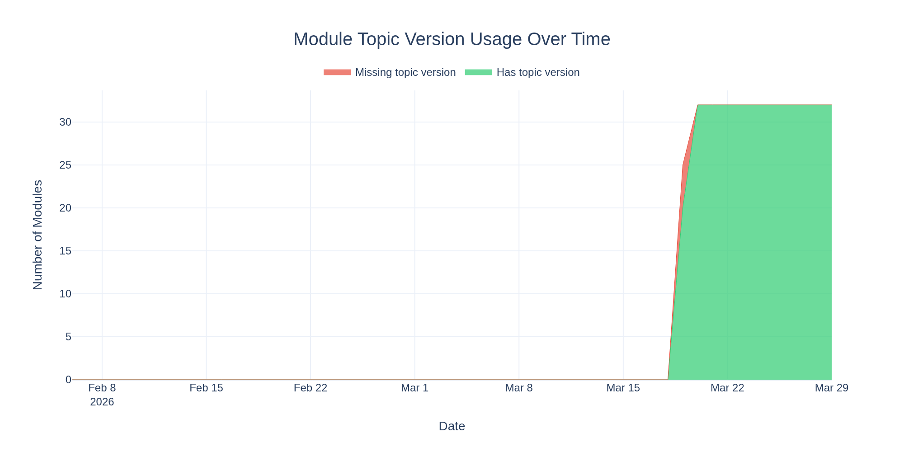
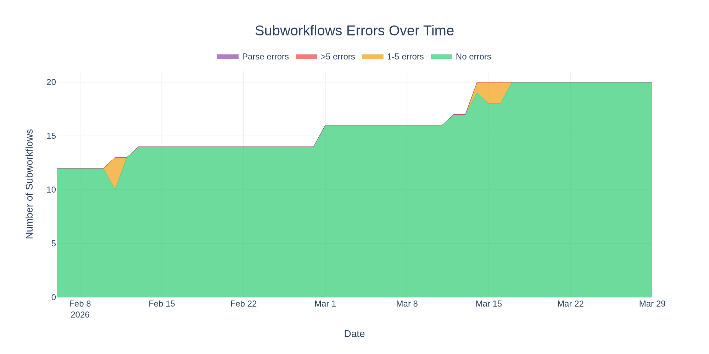
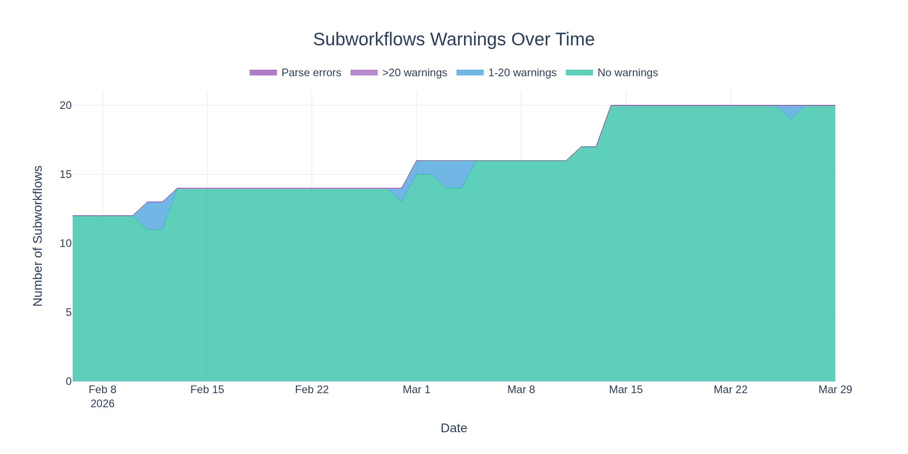

# sanger-tol Strict Syntax Health Report

This repository tracks the health of sanger-tol pipelines, modules, and subworkflows with respect to Nextflow's _strict syntax_ linting.
It is a mere sanger-tol-ification of the upstream nf-core <https://github.com/nf-core/strict-syntax-health>.

The [Nextflow docs](https://www.nextflow.io/docs/latest/strict-syntax.html) describes the differences from standard Nextflow syntax and includes many examples to help with migration and fixing errors.
Strict syntax is backwards compatible with existing Nextflow code, but enforces stricter rules to catch common errors and improve code quality.

The goal is for all sanger-tol pipelines to run without errors using strict syntax.

> [!IMPORTANT]
> See the [nf-core blog post](https://nf-co.re/blog/2025/nextflow_syntax_nf-core_roadmap) for details on the migration timeline.
> **Fixing all errors from `nextflow lint` will be a requirement by early spring 2026.**

- **Last updated:** 2026-03-29 00:12:12 UTC
- **Nextflow version:** 26.03.1-edge

## Pipelines

- **Strict syntax:** 0 parse errors, 6 errors, 117 warnings across 19 pipelines
- **Versions Mix:** 6/19 (31.6%) pipelines do not use the `ch_versions += +ch_versions.mix` anti-pattern
- **Zero issues:** 11 pipelines (57.9%)

|                    Errors                    |                     Warnings                     |
| :------------------------------------------: | :----------------------------------------------: |
|  |  |

|                  Pipeline Versions Mix                   |
| :------------------------------------------------------: |
|  |

<details>
<summary>Pipeline Results (19 pipelines)</summary>

| Pipeline                                                                                        | Parse Error | Errors | Warnings | Prints Help |         Versions Mix          |                             Lint Output                             |                               Help Output                               |
| ----------------------------------------------------------------------------------------------- | :---------: | -----: | -------: | :---------: | :---------------------------: | :-----------------------------------------------------------------: | :---------------------------------------------------------------------: |
| :x: [zippypretext](https://github.com/sanger-tol/zippypretext)                                  |     No      |      5 |       15 |      -      | :negative_squared_cross_mark: |     [View](lint_results/pipeline-results/zippypretext_lint.md)      |                                    -                                    |
| :x: [ascc](https://github.com/sanger-tol/ascc)                                                  |     No      |      1 |        7 |      -      | :negative_squared_cross_mark: |         [View](lint_results/pipeline-results/ascc_lint.md)          |                                    -                                    |
| :x: [ear](https://github.com/sanger-tol/ear)                                                    |     No      |      0 |       52 |     No      | :negative_squared_cross_mark: |          [View](lint_results/pipeline-results/ear_lint.md)          |          [View](lint_results/prints-help-results/ear_help.txt)          |
| :x: [nfmicrofinder](https://github.com/sanger-tol/nfmicrofinder)                                |     No      |      0 |       21 |     No      | :negative_squared_cross_mark: |     [View](lint_results/pipeline-results/nfmicrofinder_lint.md)     |     [View](lint_results/prints-help-results/nfmicrofinder_help.txt)     |
| :x: [tollongc](https://github.com/sanger-tol/tollongc)                                          |     No      |      0 |        8 |     No      |      :white_check_mark:       |       [View](lint_results/pipeline-results/tollongc_lint.md)        |       [View](lint_results/prints-help-results/tollongc_help.txt)        |
| :x: [blobtoolkit](https://github.com/sanger-tol/blobtoolkit)                                    |     No      |      0 |        7 |     Yes     | :negative_squared_cross_mark: |      [View](lint_results/pipeline-results/blobtoolkit_lint.md)      |      [View](lint_results/prints-help-results/blobtoolkit_help.txt)      |
| :x: [purging](https://github.com/sanger-tol/purging)                                            |     No      |      0 |        5 |     No      |      :white_check_mark:       |        [View](lint_results/pipeline-results/purging_lint.md)        |        [View](lint_results/prints-help-results/purging_help.txt)        |
| :x: [treeval](https://github.com/sanger-tol/treeval)                                            |     No      |      0 |        2 |     No      | :negative_squared_cross_mark: |        [View](lint_results/pipeline-results/treeval_lint.md)        |        [View](lint_results/prints-help-results/treeval_help.txt)        |
| :white_check_mark: [curationpretext](https://github.com/sanger-tol/curationpretext)             |     No      |      0 |        0 |     Yes     |      :white_check_mark:       |    [View](lint_results/pipeline-results/curationpretext_lint.md)    |    [View](lint_results/prints-help-results/curationpretext_help.txt)    |
| :white_check_mark: [ensemblgenedownload](https://github.com/sanger-tol/ensemblgenedownload)     |     No      |      0 |        0 |     Yes     |      :white_check_mark:       |  [View](lint_results/pipeline-results/ensemblgenedownload_lint.md)  |  [View](lint_results/prints-help-results/ensemblgenedownload_help.txt)  |
| :white_check_mark: [ensemblrepeatdownload](https://github.com/sanger-tol/ensemblrepeatdownload) |     No      |      0 |        0 |     Yes     |      :white_check_mark:       | [View](lint_results/pipeline-results/ensemblrepeatdownload_lint.md) | [View](lint_results/prints-help-results/ensemblrepeatdownload_help.txt) |
| :white_check_mark: [genomeassembly](https://github.com/sanger-tol/genomeassembly)               |     No      |      0 |        0 |     Yes     | :negative_squared_cross_mark: |    [View](lint_results/pipeline-results/genomeassembly_lint.md)     |    [View](lint_results/prints-help-results/genomeassembly_help.txt)     |
| :white_check_mark: [genomenote](https://github.com/sanger-tol/genomenote)                       |     No      |      0 |        0 |     Yes     | :negative_squared_cross_mark: |      [View](lint_results/pipeline-results/genomenote_lint.md)       |      [View](lint_results/prints-help-results/genomenote_help.txt)       |
| :white_check_mark: [insdcdownload](https://github.com/sanger-tol/insdcdownload)                 |     No      |      0 |        0 |     Yes     |      :white_check_mark:       |     [View](lint_results/pipeline-results/insdcdownload_lint.md)     |     [View](lint_results/prints-help-results/insdcdownload_help.txt)     |
| :white_check_mark: [metagenomeassembly](https://github.com/sanger-tol/metagenomeassembly)       |     No      |      0 |        0 |     Yes     | :negative_squared_cross_mark: |  [View](lint_results/pipeline-results/metagenomeassembly_lint.md)   |  [View](lint_results/prints-help-results/metagenomeassembly_help.txt)   |
| :white_check_mark: [readmapping](https://github.com/sanger-tol/readmapping)                     |     No      |      0 |        0 |     Yes     | :negative_squared_cross_mark: |      [View](lint_results/pipeline-results/readmapping_lint.md)      |      [View](lint_results/prints-help-results/readmapping_help.txt)      |
| :white_check_mark: [sequencecomposition](https://github.com/sanger-tol/sequencecomposition)     |     No      |      0 |        0 |     Yes     | :negative_squared_cross_mark: |  [View](lint_results/pipeline-results/sequencecomposition_lint.md)  |  [View](lint_results/prints-help-results/sequencecomposition_help.txt)  |
| :white_check_mark: [variantcalling](https://github.com/sanger-tol/variantcalling)               |     No      |      0 |        0 |     Yes     | :negative_squared_cross_mark: |    [View](lint_results/pipeline-results/variantcalling_lint.md)     |    [View](lint_results/prints-help-results/variantcalling_help.txt)     |
| :white_check_mark: [variantcomposition](https://github.com/sanger-tol/variantcomposition)       |     No      |      0 |        0 |     Yes     | :negative_squared_cross_mark: |  [View](lint_results/pipeline-results/variantcomposition_lint.md)   |  [View](lint_results/prints-help-results/variantcomposition_help.txt)   |

</details>

## Modules

- **Strict syntax:** 0 parse errors, 0 errors, 0 warnings across 32 modules
- **Topic + Version:** 32/32 (100.0%) modules have `topics:` and `versions:` in meta.yml
- **Zero errors:** 32 modules (100.0%)

|                   Errors                   |                    Warnings                    |
| :----------------------------------------: | :--------------------------------------------: |
|  |  |

|                   Module Topic Version Usage                    |
| :-------------------------------------------------------------: |
|  |

<details>
<summary>Module Results (32 modules)</summary>

| Module                                                                                                                                                                 | Parse Error | Errors | Warnings |     `topics:`      |    `versions:`     |                                  Lint Output                                   |
| ---------------------------------------------------------------------------------------------------------------------------------------------------------------------- | :---------: | -----: | -------: | :----------------: | :----------------: | :----------------------------------------------------------------------------: |
| :white_check_mark: [ancestral_extract](https://github.com/sanger-tol/nf-core-modules/tree/main/modules/sanger-tol/ancestral/extract)                                   |     No      |      0 |        0 | :white_check_mark: | :white_check_mark: |         [View](lint_results/module-results/ancestral_extract_lint.md)          |
| :white_check_mark: [ancestral_plot](https://github.com/sanger-tol/nf-core-modules/tree/main/modules/sanger-tol/ancestral/plot)                                         |     No      |      0 |        0 | :white_check_mark: | :white_check_mark: |           [View](lint_results/module-results/ancestral_plot_lint.md)           |
| :white_check_mark: [asmstats](https://github.com/sanger-tol/nf-core-modules/tree/main/modules/sanger-tol/asmstats)                                                     |     No      |      0 |        0 | :white_check_mark: | :white_check_mark: |              [View](lint_results/module-results/asmstats_lint.md)              |
| :white_check_mark: [bedchunks_create](https://github.com/sanger-tol/nf-core-modules/tree/main/modules/sanger-tol/bedchunks/create)                                     |     No      |      0 |        0 | :white_check_mark: | :white_check_mark: |          [View](lint_results/module-results/bedchunks_create_lint.md)          |
| :white_check_mark: [bedtools_bamtobedsort](https://github.com/sanger-tol/nf-core-modules/tree/main/modules/sanger-tol/bedtools/bamtobedsort)                           |     No      |      0 |        0 | :white_check_mark: | :white_check_mark: |       [View](lint_results/module-results/bedtools_bamtobedsort_lint.md)        |
| :white_check_mark: [bgziptabix](https://github.com/sanger-tol/nf-core-modules/tree/main/modules/sanger-tol/bgziptabix)                                                 |     No      |      0 |        0 | :white_check_mark: | :white_check_mark: |             [View](lint_results/module-results/bgziptabix_lint.md)             |
| :white_check_mark: [blast_blastn](https://github.com/sanger-tol/nf-core-modules/tree/main/modules/sanger-tol/blast/blastn)                                             |     No      |      0 |        0 | :white_check_mark: | :white_check_mark: |            [View](lint_results/module-results/blast_blastn_lint.md)            |
| :white_check_mark: [blobtoolkit_generatecsv](https://github.com/sanger-tol/nf-core-modules/tree/main/modules/sanger-tol/blobtoolkit/generatecsv)                       |     No      |      0 |        0 | :white_check_mark: | :white_check_mark: |      [View](lint_results/module-results/blobtoolkit_generatecsv_lint.md)       |
| :white_check_mark: [blobtoolkit_generateparamsfile](https://github.com/sanger-tol/nf-core-modules/tree/main/modules/sanger-tol/blobtoolkit/generateparamsfile)         |     No      |      0 |        0 | :white_check_mark: | :white_check_mark: |   [View](lint_results/module-results/blobtoolkit_generateparamsfile_lint.md)   |
| :white_check_mark: [contactbed](https://github.com/sanger-tol/nf-core-modules/tree/main/modules/sanger-tol/contactbed)                                                 |     No      |      0 |        0 | :white_check_mark: | :white_check_mark: |             [View](lint_results/module-results/contactbed_lint.md)             |
| :white_check_mark: [cramalign_bwamem2alignhic](https://github.com/sanger-tol/nf-core-modules/tree/main/modules/sanger-tol/cramalign/bwamem2alignhic)                   |     No      |      0 |        0 | :white_check_mark: | :white_check_mark: |     [View](lint_results/module-results/cramalign_bwamem2alignhic_lint.md)      |
| :white_check_mark: [cramalign_gencramchunks](https://github.com/sanger-tol/nf-core-modules/tree/main/modules/sanger-tol/cramalign/gencramchunks)                       |     No      |      0 |        0 | :white_check_mark: | :white_check_mark: |      [View](lint_results/module-results/cramalign_gencramchunks_lint.md)       |
| :white_check_mark: [cramalign_minimap2align](https://github.com/sanger-tol/nf-core-modules/tree/main/modules/sanger-tol/cramalign/minimap2align)                       |     No      |      0 |        0 | :white_check_mark: | :white_check_mark: |      [View](lint_results/module-results/cramalign_minimap2align_lint.md)       |
| :white_check_mark: [cramalign_minimap2alignhic](https://github.com/sanger-tol/nf-core-modules/tree/main/modules/sanger-tol/cramalign/minimap2alignhic)                 |     No      |      0 |        0 | :white_check_mark: | :white_check_mark: |     [View](lint_results/module-results/cramalign_minimap2alignhic_lint.md)     |
| :white_check_mark: [curationpretext_generateparamsfile](https://github.com/sanger-tol/nf-core-modules/tree/main/modules/sanger-tol/curationpretext/generateparamsfile) |     No      |      0 |        0 | :white_check_mark: | :white_check_mark: | [View](lint_results/module-results/curationpretext_generateparamsfile_lint.md) |
| :white_check_mark: [fastxalign_minimap2align](https://github.com/sanger-tol/nf-core-modules/tree/main/modules/sanger-tol/fastxalign/minimap2align)                     |     No      |      0 |        0 | :white_check_mark: | :white_check_mark: |      [View](lint_results/module-results/fastxalign_minimap2align_lint.md)      |
| :white_check_mark: [fastxalign_pyfastxindex](https://github.com/sanger-tol/nf-core-modules/tree/main/modules/sanger-tol/fastxalign/pyfastxindex)                       |     No      |      0 |        0 | :white_check_mark: | :white_check_mark: |      [View](lint_results/module-results/fastxalign_pyfastxindex_lint.md)       |
| :white_check_mark: [generatecontactsindex](https://github.com/sanger-tol/nf-core-modules/tree/main/modules/sanger-tol/generatecontactsindex)                           |     No      |      0 |        0 | :white_check_mark: | :white_check_mark: |       [View](lint_results/module-results/generatecontactsindex_lint.md)        |
| :white_check_mark: [gnk_fastasort](https://github.com/sanger-tol/nf-core-modules/tree/main/modules/sanger-tol/gnk/fastasort)                                           |     No      |      0 |        0 | :white_check_mark: | :white_check_mark: |           [View](lint_results/module-results/gnk_fastasort_lint.md)            |
| :white_check_mark: [hifiasm](https://github.com/sanger-tol/nf-core-modules/tree/main/modules/sanger-tol/hifiasm)                                                       |     No      |      0 |        0 | :white_check_mark: | :white_check_mark: |              [View](lint_results/module-results/hifiasm_lint.md)               |
| :white_check_mark: [longranger_align](https://github.com/sanger-tol/nf-core-modules/tree/main/modules/sanger-tol/longranger/align)                                     |     No      |      0 |        0 | :white_check_mark: | :white_check_mark: |          [View](lint_results/module-results/longranger_align_lint.md)          |
| :white_check_mark: [longranger_mkref](https://github.com/sanger-tol/nf-core-modules/tree/main/modules/sanger-tol/longranger/mkref)                                     |     No      |      0 |        0 | :white_check_mark: | :white_check_mark: |          [View](lint_results/module-results/longranger_mkref_lint.md)          |
| :white_check_mark: [mask_softmask2bed](https://github.com/sanger-tol/nf-core-modules/tree/main/modules/sanger-tol/mask/softmask2bed)                                   |     No      |      0 |        0 | :white_check_mark: | :white_check_mark: |         [View](lint_results/module-results/mask_softmask2bed_lint.md)          |
| :white_check_mark: [mask_unmask](https://github.com/sanger-tol/nf-core-modules/tree/main/modules/sanger-tol/mask/unmask)                                               |     No      |      0 |        0 | :white_check_mark: | :white_check_mark: |            [View](lint_results/module-results/mask_unmask_lint.md)             |
| :white_check_mark: [pretextannotate](https://github.com/sanger-tol/nf-core-modules/tree/main/modules/sanger-tol/pretextannotate)                                       |     No      |      0 |        0 | :white_check_mark: | :white_check_mark: |          [View](lint_results/module-results/pretextannotate_lint.md)           |
| :white_check_mark: [restructurebuscodir](https://github.com/sanger-tol/nf-core-modules/tree/main/modules/sanger-tol/restructurebuscodir)                               |     No      |      0 |        0 | :white_check_mark: | :white_check_mark: |        [View](lint_results/module-results/restructurebuscodir_lint.md)         |
| :white_check_mark: [samtools_mergedup](https://github.com/sanger-tol/nf-core-modules/tree/main/modules/sanger-tol/samtools/mergedup)                                   |     No      |      0 |        0 | :white_check_mark: | :white_check_mark: |         [View](lint_results/module-results/samtools_mergedup_lint.md)          |
| :white_check_mark: [telomere_extract](https://github.com/sanger-tol/nf-core-modules/tree/main/modules/sanger-tol/telomere/extract)                                     |     No      |      0 |        0 | :white_check_mark: | :white_check_mark: |          [View](lint_results/module-results/telomere_extract_lint.md)          |
| :white_check_mark: [telomere_regions](https://github.com/sanger-tol/nf-core-modules/tree/main/modules/sanger-tol/telomere/regions)                                     |     No      |      0 |        0 | :white_check_mark: | :white_check_mark: |          [View](lint_results/module-results/telomere_regions_lint.md)          |
| :white_check_mark: [telomere_windows](https://github.com/sanger-tol/nf-core-modules/tree/main/modules/sanger-tol/telomere/windows)                                     |     No      |      0 |        0 | :white_check_mark: | :white_check_mark: |          [View](lint_results/module-results/telomere_windows_lint.md)          |
| :white_check_mark: [yahs_makepairsfile](https://github.com/sanger-tol/nf-core-modules/tree/main/modules/sanger-tol/yahs/makepairsfile)                                 |     No      |      0 |        0 | :white_check_mark: | :white_check_mark: |         [View](lint_results/module-results/yahs_makepairsfile_lint.md)         |
| :white_check_mark: [yak_count](https://github.com/sanger-tol/nf-core-modules/tree/main/modules/sanger-tol/yak/count)                                                   |     No      |      0 |        0 | :white_check_mark: | :white_check_mark: |             [View](lint_results/module-results/yak_count_lint.md)              |

</details>

## Subworkflows

- **Strict syntax:** 0 parse errors, 0 errors, 0 warnings across 20 subworkflows
- **Versions channel:** 20/20 (100.0%) subworkflows do not emit a `versions` output channel
- **Zero errors:** 20 subworkflows (100.0%)

|                     Errors                      |                      Warnings                       |
| :---------------------------------------------: | :-------------------------------------------------: |
|  |  |

<details>
<summary>Subworkflow Results (20 subworkflows)</summary>

| Subworkflow                                                                                                                                                                             | Parse Error | Errors | Warnings |  versions channel  |                                        Lint Output                                        |
| --------------------------------------------------------------------------------------------------------------------------------------------------------------------------------------- | :---------: | -----: | -------: | :----------------: | :---------------------------------------------------------------------------------------: |
| :white_check_mark: [ancestral_annotation](https://github.com/sanger-tol/nf-core-modules/tree/main/subworkflows/sanger-tol/ancestral_annotation)                                         |     No      |      0 |        0 | :white_check_mark: |           [View](lint_results/subworkflow-results/ancestral_annotation_lint.md)           |
| :white_check_mark: [bam2cool](https://github.com/sanger-tol/nf-core-modules/tree/main/subworkflows/sanger-tol/bam2cool)                                                                 |     No      |      0 |        0 | :white_check_mark: |                 [View](lint_results/subworkflow-results/bam2cool_lint.md)                 |
| :white_check_mark: [bam_samtools_merge_markdup](https://github.com/sanger-tol/nf-core-modules/tree/main/subworkflows/sanger-tol/bam_samtools_merge_markdup)                             |     No      |      0 |        0 | :white_check_mark: |        [View](lint_results/subworkflow-results/bam_samtools_merge_markdup_lint.md)        |
| :white_check_mark: [cram_map_illumina_hic](https://github.com/sanger-tol/nf-core-modules/tree/main/subworkflows/sanger-tol/cram_map_illumina_hic)                                       |     No      |      0 |        0 | :white_check_mark: |          [View](lint_results/subworkflow-results/cram_map_illumina_hic_lint.md)           |
| :white_check_mark: [cram_map_long_reads](https://github.com/sanger-tol/nf-core-modules/tree/main/subworkflows/sanger-tol/cram_map_long_reads)                                           |     No      |      0 |        0 | :white_check_mark: |           [View](lint_results/subworkflow-results/cram_map_long_reads_lint.md)            |
| :white_check_mark: [fasta_10x_polishing_longranger_freebayes](https://github.com/sanger-tol/nf-core-modules/tree/main/subworkflows/sanger-tol/fasta_10x_polishing_longranger_freebayes) |     No      |      0 |        0 | :white_check_mark: | [View](lint_results/subworkflow-results/fasta_10x_polishing_longranger_freebayes_lint.md) |
| :white_check_mark: [fasta_bam_scaffolding_yahs](https://github.com/sanger-tol/nf-core-modules/tree/main/subworkflows/sanger-tol/fasta_bam_scaffolding_yahs)                             |     No      |      0 |        0 | :white_check_mark: |        [View](lint_results/subworkflow-results/fasta_bam_scaffolding_yahs_lint.md)        |
| :white_check_mark: [fasta_compress_index](https://github.com/sanger-tol/nf-core-modules/tree/main/subworkflows/sanger-tol/fasta_compress_index)                                         |     No      |      0 |        0 | :white_check_mark: |           [View](lint_results/subworkflow-results/fasta_compress_index_lint.md)           |
| :white_check_mark: [fasta_purge_retained_haplotype](https://github.com/sanger-tol/nf-core-modules/tree/main/subworkflows/sanger-tol/fasta_purge_retained_haplotype)                     |     No      |      0 |        0 | :white_check_mark: |      [View](lint_results/subworkflow-results/fasta_purge_retained_haplotype_lint.md)      |
| :white_check_mark: [fastx_map_long_reads](https://github.com/sanger-tol/nf-core-modules/tree/main/subworkflows/sanger-tol/fastx_map_long_reads)                                         |     No      |      0 |        0 | :white_check_mark: |           [View](lint_results/subworkflow-results/fastx_map_long_reads_lint.md)           |
| :white_check_mark: [feature_density](https://github.com/sanger-tol/nf-core-modules/tree/main/subworkflows/sanger-tol/feature_density)                                                   |     No      |      0 |        0 | :white_check_mark: |             [View](lint_results/subworkflow-results/feature_density_lint.md)              |
| :white_check_mark: [gap_finder](https://github.com/sanger-tol/nf-core-modules/tree/main/subworkflows/sanger-tol/gap_finder)                                                             |     No      |      0 |        0 | :white_check_mark: |                [View](lint_results/subworkflow-results/gap_finder_lint.md)                |
| :white_check_mark: [genome_statistics](https://github.com/sanger-tol/nf-core-modules/tree/main/subworkflows/sanger-tol/genome_statistics)                                               |     No      |      0 |        0 | :white_check_mark: |            [View](lint_results/subworkflow-results/genome_statistics_lint.md)             |
| :white_check_mark: [get_blobtk_plots](https://github.com/sanger-tol/nf-core-modules/tree/main/subworkflows/sanger-tol/get_blobtk_plots)                                                 |     No      |      0 |        0 | :white_check_mark: |             [View](lint_results/subworkflow-results/get_blobtk_plots_lint.md)             |
| :white_check_mark: [pacbio_preprocess](https://github.com/sanger-tol/nf-core-modules/tree/main/subworkflows/sanger-tol/pacbio_preprocess)                                               |     No      |      0 |        0 | :white_check_mark: |            [View](lint_results/subworkflow-results/pacbio_preprocess_lint.md)             |
| :white_check_mark: [pairs_create_contact_maps](https://github.com/sanger-tol/nf-core-modules/tree/main/subworkflows/sanger-tol/pairs_create_contact_maps)                               |     No      |      0 |        0 | :white_check_mark: |        [View](lint_results/subworkflow-results/pairs_create_contact_maps_lint.md)         |
| :white_check_mark: [repeat_density](https://github.com/sanger-tol/nf-core-modules/tree/main/subworkflows/sanger-tol/repeat_density)                                                     |     No      |      0 |        0 | :white_check_mark: |              [View](lint_results/subworkflow-results/repeat_density_lint.md)              |
| :white_check_mark: [repeat_masking](https://github.com/sanger-tol/nf-core-modules/tree/main/subworkflows/sanger-tol/repeat_masking)                                                     |     No      |      0 |        0 | :white_check_mark: |              [View](lint_results/subworkflow-results/repeat_masking_lint.md)              |
| :white_check_mark: [soft_masked_fasta_repeats](https://github.com/sanger-tol/nf-core-modules/tree/main/subworkflows/sanger-tol/soft_masked_fasta_repeats)                               |     No      |      0 |        0 | :white_check_mark: |        [View](lint_results/subworkflow-results/soft_masked_fasta_repeats_lint.md)         |
| :white_check_mark: [telo_finder](https://github.com/sanger-tol/nf-core-modules/tree/main/subworkflows/sanger-tol/telo_finder)                                                           |     No      |      0 |        0 | :white_check_mark: |               [View](lint_results/subworkflow-results/telo_finder_lint.md)                |

</details>

## About

This report is generated daily by running `nextflow lint` on each sanger-tol pipeline, module, and subworkflow.
The linting checks for strict syntax compliance in Nextflow DSL2 code.

- **Parse errors** indicate items where `nextflow lint` could not run at all, typically due to syntax errors that prevent Nextflow from parsing the code
- **Errors** indicate syntax issues that will cause problems in future Nextflow versions
- **Warnings** indicate deprecated patterns that should be updated, but having warnings is fine (though it's nice to fix those as well if possible)
- **Prints Help** (pipelines only) tests whether the pipeline can print its help message using the v2 syntax parser (`NXF_SYNTAX_PARSER=v2 nextflow run . --help`). This test only runs for pipelines with zero lint errors.

## Running Locally

You can run `nextflow lint` on your own pipeline to check for strict syntax issues:

```bash
nextflow lint .
```

> **Note:** Until [this fix](https://github.com/nextflow-io/nextflow/pull/6716) is included in a Nextflow edge release, you may need to exclude nf-test files manually:
>
> ```bash
> nextflow lint . -exclude ".git,.nf-test,nf-test.config"
> ```

See the [strict syntax documentation](https://www.nextflow.io/docs/latest/strict-syntax.html) for more information about the rules being checked.

## Getting Help

If you need help fixing strict syntax errors in your pipeline, the [Nextflow community forum](https://community.seqera.io/) is a great place to ask questions.
